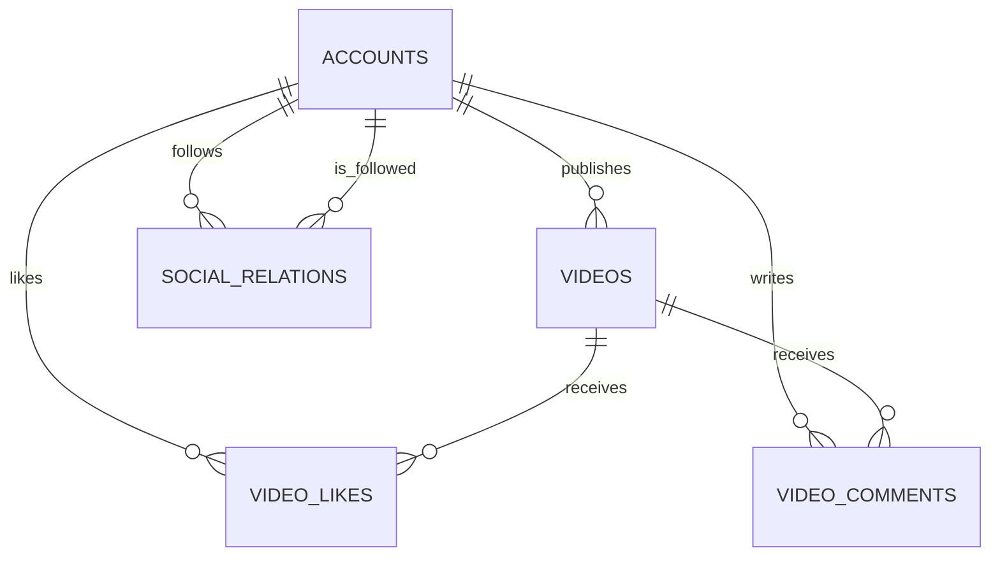
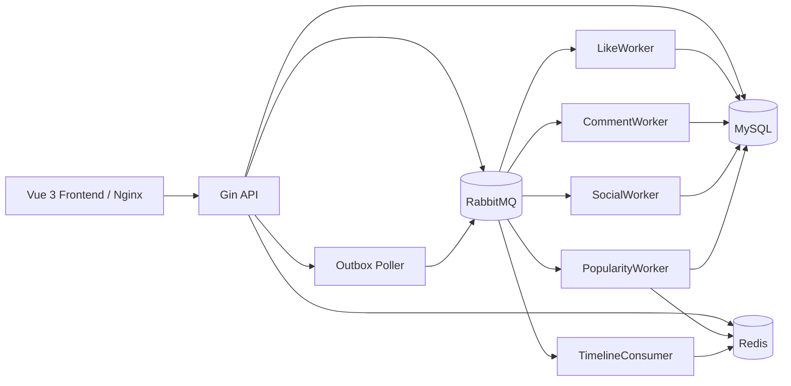
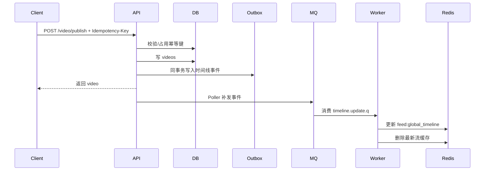
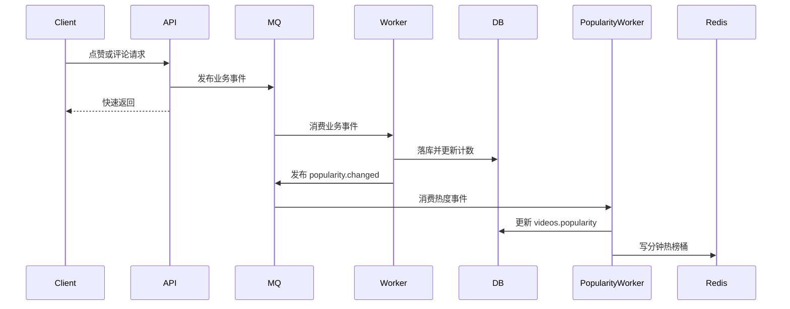

# my_feed_system 系统设计说明

> 项目介绍：`my_feed_system` 是一个面向短视频场景的 Feed 流系统，采用 `Go + Gin + GORM + MySQL + Redis + RabbitMQ + Vue 3` 实现，覆盖账号、视频、点赞、评论、关注、最新流、关注流、热榜流等能力，并通过幂等、Outbox、异步 Worker、缓存与限流机制增强工程可用性。

## 1. 技术栈

| 维度 | 组件/工具 | 说明 |
| --- | --- | --- |
| 开发语言 | Go | 后端 API 与异步 Worker 均由 Go 编写。 |
| Web 框架 | Gin | 负责路由编排、参数绑定、中间件链与静态文件挂载。 |
| ORM | GORM | 用于模型定义、CRUD 与启动时自动迁移。 |
| 持久化 | MySQL 8 | 存储账号、视频、点赞、评论、关注、Outbox、消费去重等数据。 |
| 缓存 | Redis 7 | 用于 Token 缓存、视频详情缓存、最新流缓存、全局时间线、热榜与限流计数。 |
| 消息队列 | RabbitMQ 3 | 承载点赞、评论、关注、热度、时间线更新等异步事件。 |
| 异步执行 | Worker | 独立 `backend/cmd/worker` 进程消费 MQ 消息并更新 MySQL/Redis。 |
| 前端 | Vue 3 + Pinia + Vue Router + Vite | 提供首页 Feed、热榜、上传、详情、账户、个人主页等页面。 |
| 容器编排 | Docker Compose | 一键启动 `mysql + redis + rabbitmq + backend + worker + frontend`。 |
| 可观测性 | pprof + Prometheus metrics | API 暴露 `/metrics`，并保留独立 pprof 配置开关。 |

## 2. Docker Compose 一键启动（推荐）

要求：已安装 Docker Desktop / Docker Engine + Docker Compose。

```bash
docker compose up -d --build
```

访问：

- 前端：`http://localhost:5173`
- 后端 API：`http://localhost:8080`
- RabbitMQ 管理台：`http://localhost:15672`（默认账号 `admin` / `password123`）

说明：

- Compose 会启动 `mysql`、`redis`、`rabbitmq`、`backend`（API）、`worker`、`frontend`。
- 容器内后端配置使用 `backend/configs/config.docker.yaml`，并挂载到 `/app/configs/config.yaml`。
- 上传目录挂载到命名卷 `uploads_data`，避免容器重建后媒体文件丢失。
- MySQL 会自动创建数据库 `my_feed_system`；GORM 会在 API / Worker 启动时自动迁移表结构。
- 如宿主机端口已被占用，可通过环境变量覆盖宿主机映射端口，例如 `RABBITMQ_MANAGEMENT_PORT=15673`。

## 3. 目录结构

```text
my_feed_system/
├─ backend/
│  ├─ cmd/
│  │  ├─ main.go
│  │  └─ worker/main.go
│  ├─ configs/
│  │  ├─ config.yaml
│  │  └─ config.docker.yaml
│  ├─ internal/
│  │  ├─ account/
│  │  ├─ cachex/
│  │  ├─ comment/
│  │  ├─ db/
│  │  ├─ feed/
│  │  ├─ idempotency/
│  │  ├─ like/
│  │  ├─ middleware/
│  │  ├─ mq/
│  │  ├─ observability/
│  │  ├─ outbox/
│  │  ├─ popularity/
│  │  ├─ social/
│  │  ├─ video/
│  │  └─ worker/
│  └─ Dockerfile
├─ frontend/
├─ nginx/
├─ docker-compose.yaml
└─ my_feed_system系统设计说明.md
```

## 4. 核心数据模型

### 4.1 业务主表

| 表名 | 作用 | 关键字段 |
| --- | --- | --- |
| `accounts` | 用户账号 | `id`、`username`、`password`、`token` |
| `videos` | 视频主表 | `id`、`author_id`、`title`、`description`、`play_url`、`cover_url`、`likes_count`、`comment_count`、`popularity` |
| `video_likes` | 点赞关系 | `video_id`、`account_id` |
| `video_comments` | 评论与回复 | `video_id`、`root_comment_id`、`parent_comment_id`、`reply_to_user_id` |
| `social_relations` | 关注关系 | `follower_id`、`vlogger_id` |

### 4.2 工程保障表

| 表名 | 作用 | 关键字段 |
| --- | --- | --- |
| `processed_messages` | Worker 消费去重 | `consumer_group`、`event_id` |
| `idempotency_keys` | 视频发布幂等 | `account_id`、`biz_type`、`idem_key` |
| `outbox_messages` | 本地事务消息 | `event_type`、`status`、`attempt_count`、`next_attempt_at` |
| `popularity_projections` | 热度投影 | `video_id`、`delta`、`reason`、`processed` |

### 4.3 关系概览



## 5. 模块设计

### 5.1 账号系统

| 路由 | 鉴权 | 说明 |
| --- | --- | --- |
| `POST /account/register` | 否 | 注册账号，密码 bcrypt 哈希存储。 |
| `POST /account/login` | 否 | 登录成功后签发 JWT，并写入当前有效 token。 |
| `POST /account/findByID` | 否 | 查询公开用户信息。 |
| `POST /account/findByUsername` | 否 | 按用户名查询公开信息。 |
| `GET /account/me` | 是 | 返回当前登录用户。 |
| `POST /account/logout` | 是 | 清空服务端 token。 |
| `POST /account/changePassword` | 是 | 修改密码后强制重新登录。 |
| `POST /account/rename` | 是 | 改名并签发新 token。 |

设计要点：

1. JWT 校验不是只验签，还会校验该 token 是否仍是服务端当前有效 token。
2. Redis 作为 token 缓存，失效后可以从 MySQL 回源并自愈回填。

### 5.2 视频系统

| 路由 | 鉴权 | 说明 |
| --- | --- | --- |
| `POST /video/uploadVideo` | 是 | 上传视频文件，返回 `/static/videos/...` 路径。 |
| `POST /video/uploadCover` | 是 | 上传封面文件，返回 `/static/covers/...` 路径。 |
| `POST /video/publish` | 是 | 发布视频，带幂等保护并写入 Outbox。 |
| `POST /video/listByAuthorID` | 否 | 作者主页视频列表。 |
| `POST /video/listLiked` | 是 | 当前用户点赞过的视频列表。 |
| `POST /video/getDetail` | 否 | 视频详情，优先读缓存。 |

设计要点：

1. `Idempotency-Key` 是视频发布的核心保护手段，避免重复创建视频。
2. `play_url` 和 `cover_url` 必须是受管静态资源路径。
3. 发布成功后通过 Outbox 驱动时间线更新，而不是同步串行刷新 Feed。

### 5.3 点赞系统

| 路由 | 鉴权 | 说明 |
| --- | --- | --- |
| `POST /like/like` | 是 | 点赞视频。 |
| `POST /like/unlike` | 是 | 取消点赞。 |
| `POST /like/isLiked` | 是 | 查询当前用户是否已点赞。 |
| `POST /like/listLikedVideoIDs` | 是 | 批量查询已点赞视频 ID。 |

设计要点：

1. 优先发布 MQ 事件，由 `LikeWorker` 异步落库。
2. 若未接入 Publisher，则自动降级为同步事务写库。
3. 点赞变化会触发详情缓存失效，并继续推动热度变更。

### 5.4 评论系统

| 路由 | 鉴权 | 说明 |
| --- | --- | --- |
| `POST /comment/listAll` | 否 | 查询某视频下的评论树。 |
| `POST /comment/publish` | 是 | 发布评论或二级回复。 |
| `POST /comment/delete` | 是 | 删除评论，必要时删除整棵回复树。 |

设计要点：

1. 通过 `root_comment_id` 与 `parent_comment_id` 支持两层评论树。
2. 异步写链路下，评论 ID 会在 API 侧先生成，方便前端拿到稳定对象。

### 5.5 关注系统

| 路由 | 鉴权 | 说明 |
| --- | --- | --- |
| `POST /social/follow` | 是 | 关注作者，不能关注自己。 |
| `POST /social/unfollow` | 是 | 取消关注。 |
| `POST /social/getAllFollowers` | 是 | 查询粉丝列表。 |
| `POST /social/getAllVloggers` | 是 | 查询关注列表。 |

设计要点：

1. `(follower_id, vlogger_id)` 唯一约束保证关系不重复。
2. 写操作可通过 MQ 异步落库，接口层保持响应轻量。

### 5.6 Feed 系统

| 路由 | 鉴权 | 说明 |
| --- | --- | --- |
| `POST /feed/listLatest` | 否 | 最新流，基于游标分页。 |
| `POST /feed/listLikesCount` | 否 | 按点赞数排序的公共流。 |
| `POST /feed/listByPopularity` | 否 | 热榜流，基于 Redis 滑动窗口与快照分页。 |
| `POST /feed/listByFollowing` | 是 | 当前用户的关注流。 |

设计要点：

1. `listLatest` 优先读 Redis 最新流缓存与全局时间线，失败时回退 MySQL。
2. `listLikesCount` 使用 `likes_count + id` 复合游标，保证稳定分页。
3. `listByPopularity` 使用 `as_of + offset` 保证翻页期间榜单稳定。

## 6. 异步消息与 Worker 设计

### 6.1 Exchange / Queue

| 业务域 | Exchange | Queue | 主要事件 |
| --- | --- | --- | --- |
| 点赞 | `like.events` | `like.write.q` | `like.created`、`like.deleted` |
| 评论 | `comment.events` | `comment.write.q` | `comment.created`、`comment.deleted` |
| 关注 | `social.events` | `social.write.q` | `social.followed`、`social.unfollowed` |
| 热度 | `popularity.events` | `popularity.update.q` | `popularity.changed` |
| 时间线 | `video.timeline.events` | `timeline.update.q` | `video.timeline.publish` |
| 本地缓存失效 | `cache.invalidate.events` | 临时 fanout 队列 | 详情页 / 最新流 L1 缓存失效 |

### 6.2 Worker 分工

| Worker | 职责 |
| --- | --- |
| `LikeWorker` | 写点赞关系、更新 `likes_count`、发布热度事件、清理详情缓存 |
| `CommentWorker` | 写评论树、更新 `comment_count`、发布热度事件、清理详情缓存 |
| `SocialWorker` | 写关注/取关关系 |
| `PopularityWorker` | 更新 `videos.popularity`，写 Redis 热榜分钟桶 |
| `TimelineConsumer` | 写全局时间线，统一失效最新流缓存 |

### 6.3 消费幂等

1. Worker 消费前先写 `processed_messages`。
2. 若 `(consumer_group, event_id)` 已存在，则说明消息之前已经处理过，直接按成功返回。
3. 这样可以抵抗 RabbitMQ 重投、消费者重启与网络抖动造成的重复消费。

## 7. Redis 设计

| 业务 | 数据类型 | Key 模式 | TTL | 说明 |
| --- | --- | --- | --- | --- |
| Token 缓存 | String | `account:token:<accountID>` | 24h | JWT 校验缓存，未命中可回源。 |
| 视频详情缓存 | String | `video:detail:id=<videoID>` | 5m | 详情页优先读取。 |
| 最新流缓存 | String | `feed:listLatest:*` | 5s | 匿名最新流短 TTL 缓存。 |
| 全局时间线 | ZSet | `feed:global_timeline` | 常驻 | 保存全站最新视频候选集。 |
| 热度分钟桶 | ZSet | `hot:video:1m:<yyyyMMddHHmm>` | 2h | 按分钟累计热度增量。 |
| 热榜快照 | ZSet | `hot:video:merge:1m:<as_of>` | 2m | 合并窗口结果，支持稳定分页。 |
| 限流计数 | String | `ratelimit:<scope>:<subject>` | 窗口期 | 固定窗口限流。 |

## 8. 一致性与降级策略

### 8.1 接口幂等

视频发布接口通过 `Idempotency-Key` 保证：

1. 同一账号、同一业务、同一幂等键只产生一个视频结果。
2. 若同 key 绑定了不同请求体，会直接返回冲突。
3. 若首个请求仍在处理中，后续请求会收到忙碌/冲突响应。

### 8.2 Outbox

视频发布在事务中同时写入 `videos` 和 `outbox_messages`，随后由 `outbox.Poller` 扫描补发到 RabbitMQ，避免“视频已落库但时间线事件没发出去”。

### 8.3 降级行为

| 异常依赖 | 系统表现 |
| --- | --- |
| Redis 不可用 | API 退化为 MySQL-only；缓存、热榜、限流能力部分失效，但核心业务可继续运行。 |
| RabbitMQ 不可用 | API 启动后仍可服务；视频发布时间线事件进入 Outbox 等待后续补发。 |
| MQ Publisher 缺失 | 点赞、评论、关注自动走同步事务写库。 |
| 热度缓存不可用 | 热度仍会落到 MySQL `videos.popularity` 字段。 |

## 9. 限流与可观测性

### 9.1 固定窗口限流

| 业务 | 维度 | 阈值 |
| --- | --- | --- |
| 登录 | IP | 1 分钟 10 次 |
| 注册 | IP | 10 分钟 5 次 |
| 点赞 / 取消点赞 | IP + 账号 | 1 分钟 60 次 / 30 次 |
| 发布评论 | IP + 账号 | 1 分钟 30 次 / 15 次 |
| 删除评论 | IP + 账号 | 1 分钟 40 次 / 20 次 |
| 关注 / 取关 | IP + 账号 | 1 分钟 40 次 / 20 次 |

设计上采用 `FailOpen`，即限流器异常时默认放行业务请求，避免 Redis 故障反向拖垮主链路。

### 9.2 可观测性

1. API 暴露 `GET /metrics`，可接 Prometheus 抓取。
2. pprof 可通过配置独立开启，API / Worker 分别支持独立端口。

## 10. 整体架构



## 11. 核心流程

### 11.1 视频发布



### 11.2 点赞 / 评论异步写链路



## 12. 前端页面能力

| 路由 | 页面 |
| --- | --- |
| `/` | 首页 Feed |
| `/likes` | 点赞列表入口 |
| `/following` | 关注流入口 |
| `/hot` | 热榜页 |
| `/video` | 视频上传 / 发布页 |
| `/video/:id` | 视频详情页 |
| `/account` | 登录页 |
| `/account/register` | 注册页 |
| `/account/change-password` | 修改密码页 |
| `/settings` | 设置页 |
| `/u/:id` | 用户主页 |

## 13. 项目亮点

1. 视频发布链路同时具备幂等与 Outbox，兼顾重复请求防护与事务消息可靠性。
2. 写操作通过 API / Worker 分离削峰，降低同步请求时延。
3. Redis 与 RabbitMQ 都设计了退化路径，不会因为单个基础设施故障让核心业务整体不可用。
4. 热榜采用分钟桶与快照分页，兼顾高频写入和稳定浏览体验。
5. Docker Compose 已对齐完整服务栈，方便本地演示、开发与部署。
