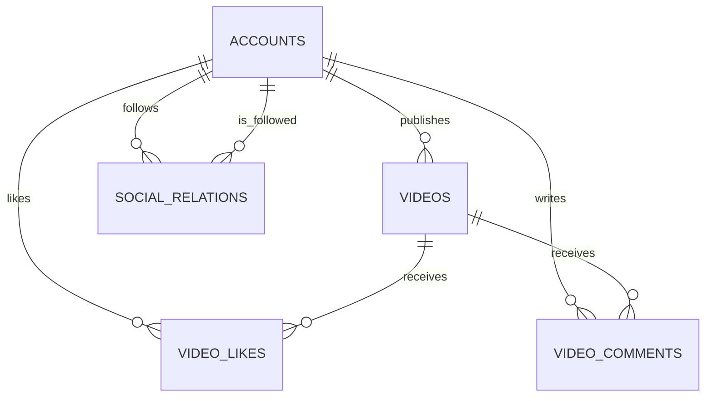
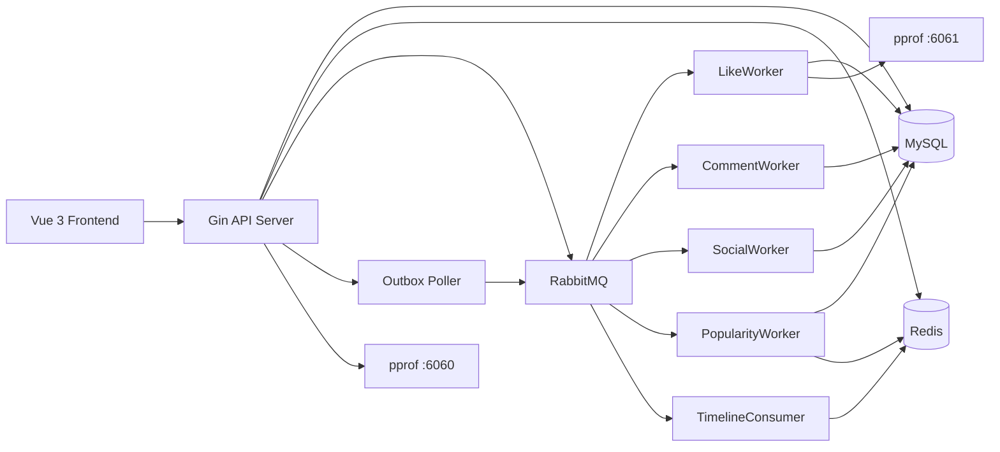
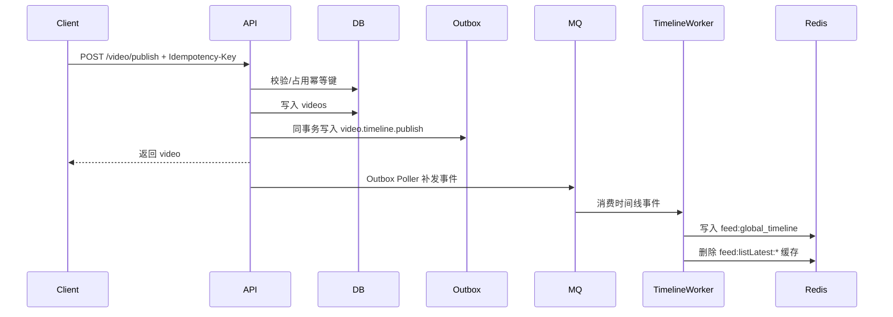
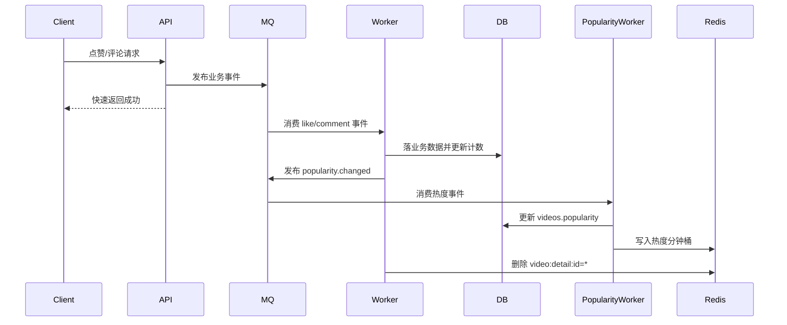
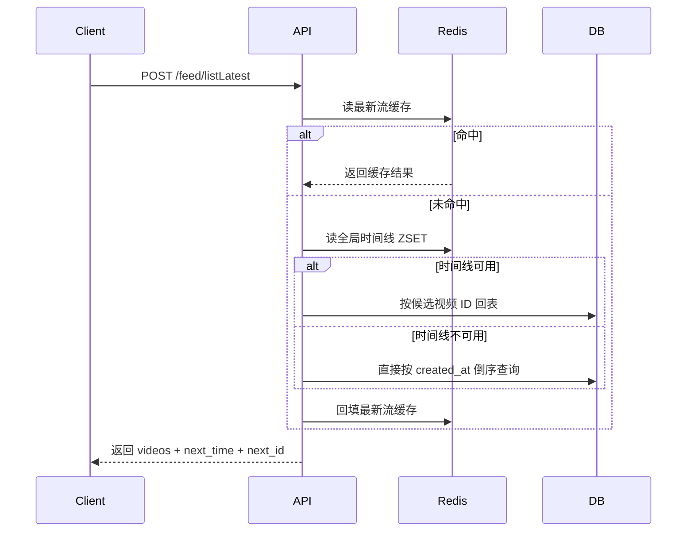

# my_feed_system 项目设计

> 项目介绍：`my_feed_system` 是一个面向短视频场景的 Feed 流系统，采用 `Go + Gin + GORM + MySQL + Redis + RabbitMQ + Vue 3` 实现，包含账号、视频上传与发布、点赞、评论、关注、推荐流、关注流、热榜流等能力，并通过 Worker、Outbox、幂等、缓存、限流与可观测性机制提升一致性与可用性。

## 技术栈

| 维度 | 组件/工具 | 说明 |
| --- | --- | --- |
| 开发语言 | Go | 后端核心业务逻辑与异步 Worker 均由 Go 实现。 |
| Web 框架 | Gin | 负责 HTTP 路由、参数绑定、中间件链与静态资源挂载。 |
| ORM | GORM | 数据模型定义、自动迁移、事务控制与常规 CRUD。 |
| 持久化 | MySQL 8+ | 存储账号、视频、点赞、评论、关注关系，以及消费幂等、接口幂等、Outbox 等表。 |
| 缓存 | Redis 6+ | 用于 Token 缓存、视频详情缓存、最新流缓存、全局时间线、热榜滑动窗口和限流计数。 |
| 消息队列 | RabbitMQ 3+ | 用于点赞、评论、关注、热度、时间线更新等事件异步化处理。 |
| 异步执行 | Worker | 独立 `backend/cmd/worker` 进程消费 MQ 消息，执行落库、计数更新、热度更新与缓存失效。 |
| 前端 | Vue 3 + Pinia + Vue Router + Vite | 提供本地联调页面，覆盖首页 Feed、热榜、上传、详情、账户、个人主页等视图。 |
| 本地代理 | Nginx | 可选的本地反向代理方案，便于模拟生产式访问入口。 |
| 可观测性 | pprof | API 与 Worker 分别暴露独立 `pprof` 端口，便于性能诊断。 |
| 启动方式 | PowerShell 脚本 | 仓库根目录提供 `start-local.ps1` / `stop-local.ps1` 一键拉起本地开发链路。 |

## 项目目标

本项目的核心目标不是只做一个“能跑通接口”的视频系统，而是围绕 Feed 场景补齐一套更接近真实后端系统的工程能力：

1. 支持短视频业务里的核心对象与关系，包括账号、视频、点赞、评论、关注与多种 Feed。
2. 让写链路具备可扩展性，避免所有副作用都阻塞在同步 HTTP 请求中。
3. 在 Redis / RabbitMQ 不可用时保留可降级能力，保证核心业务仍可工作。
4. 通过幂等、Outbox、消费去重与限流，降低重复请求、重复消费和恶意刷请求带来的风险。
5. 让前后端可以本地一键联调，降低演示、开发与调试成本。

## 目录结构

```text
my_feed_system/
├─ backend/
│  ├─ cmd/
│  │  ├─ main.go                 # API 进程入口
│  │  └─ worker/main.go          # Worker 进程入口
│  ├─ configs/config.yaml        # 本地配置
│  └─ internal/
│     ├─ account/                # 账号模块
│     ├─ video/                  # 视频模块
│     ├─ like/                   # 点赞模块
│     ├─ comment/                # 评论模块
│     ├─ social/                 # 关注模块
│     ├─ feed/                   # Feed 模块
│     ├─ mq/                     # RabbitMQ 封装与消息定义
│     ├─ outbox/                 # Outbox 模块
│     ├─ idempotency/            # 接口幂等模块
│     ├─ middleware/             # JWT 与限流中间件
│     ├─ worker/                 # 各类 Worker 实现
│     ├─ db/                     # MySQL / Redis 初始化
│     └─ observability/          # pprof
├─ frontend/
│  └─ src/
│     ├─ api/                    # 请求封装
│     ├─ views/                  # 页面视图
│     ├─ stores/                 # Pinia 状态管理
│     └─ router/                 # 前端路由
├─ nginx/                        # 本地代理配置
├─ start-local.ps1
└─ stop-local.ps1
```

## 核心数据表设计

### 业务主表

| 表名 | 作用 | 关键字段 |
| --- | --- | --- |
| `accounts` | 用户账号 | `id`、`username`、`password`、`token` |
| `videos` | 视频主表 | `id`、`author_id`、`title`、`play_url`、`cover_url`、`likes_count`、`comment_count`、`popularity` |
| `video_likes` | 点赞关系 | `video_id`、`account_id` 唯一约束 |
| `video_comments` | 评论与回复 | `video_id`、`root_comment_id`、`parent_comment_id`、`reply_to_user_id` |
| `social_relations` | 关注关系 | `follower_id`、`vlogger_id` 唯一约束 |

### 工程保障表

| 表名 | 作用 | 关键字段 |
| --- | --- | --- |
| `processed_messages` | Worker 消费去重 | `consumer_group + event_id` 唯一约束 |
| `idempotency_keys` | 视频发布接口幂等 | `account_id + biz_type + idem_key` 唯一约束 |
| `outbox_messages` | 本地事务消息表 | `status`、`attempt_count`、`next_attempt_at`、`lease_token` |

### 表关系概览



## 模块设计

### 1. 账号系统

#### 目标

提供注册、登录、鉴权、登出、改密、改名与公开信息查询能力，并通过 Redis 缓存当前有效 Token。

#### 接口设计

| 路由 | 鉴权 | 输入 | 输出 | 核心说明 |
| --- | --- | --- | --- | --- |
| `POST /account/register` | 否 | `username`、`password` | `account` | 注册时校验用户名唯一，密码以 bcrypt 哈希存储。 |
| `POST /account/login` | 否 | `username`、`password` | `account`、`token` | 登录成功后签发 JWT，并把 token 持久化到 MySQL。 |
| `POST /account/findByID` | 否 | `id` | `account` | 查询公开用户信息。 |
| `POST /account/findByUsername` | 否 | `username` | `account` | 按用户名查询用户信息。 |
| `GET /account/me` | 是 | 无 | 当前登录账号信息 | 由 JWT 中间件解析并透传登录态。 |
| `POST /account/logout` | 是 | 无 | `message` | 服务端清空 token，实现可撤销登录。 |
| `POST /account/changePassword` | 是 | `old_password`、`new_password` | `message` | 改密后清空旧 token，要求重新登录。 |
| `POST /account/rename` | 是 | `new_username` | `account`、`token` | 改名后重新签发 token，避免 JWT 中用户名过期。 |

#### 设计说明

1. JWT 中间件不仅校验签名，还会校验该 token 是否仍是服务端记录的当前有效 token。
2. Redis 中的 `account:token:<accountID>` 作为快速鉴权缓存，TTL 为 24 小时。
3. 当 Redis 未命中时，会回源 MySQL 对比 `accounts.token`，校验通过后再回填 Redis，形成“缓存自愈”。

### 2. 视频系统

#### 目标

提供媒体上传、视频发布、作者视频列表、点赞视频列表与详情查询能力，并对发布写链路增加接口幂等与 Outbox。

#### 接口设计

| 路由 | 鉴权 | 输入 | 输出 | 核心说明 |
| --- | --- | --- | --- | --- |
| `POST /video/uploadVideo` | 是 | 表单文件 | `url` | 仅允许受管视频文件上传，最终映射到 `/static/videos/...`。 |
| `POST /video/uploadCover` | 是 | 表单文件 | `url` | 仅允许受管封面文件上传，最终映射到 `/static/covers/...`。 |
| `POST /video/publish` | 是 | `title`、`description`、`play_url`、`cover_url` | `video` | 依赖幂等键避免重复发布，同时投递时间线 Outbox。 |
| `POST /video/listByAuthorID` | 否 | `author_id` | `videos[]` | 作者主页视频列表。 |
| `POST /video/listLiked` | 是 | 无 | `videos[]` | 当前用户点赞过的视频列表。 |
| `POST /video/getDetail` | 否 | `id` | `video` | 优先读详情缓存，未命中再回源数据库。 |

#### 设计说明

1. 发布接口要求客户端传 `Idempotency-Key` 请求头，或兼容旧字段 `client_request_id`。
2. 幂等逻辑把 `account_id + biz_type + idem_key` 作为作用域，并结合请求体哈希判断是否是“同 key 同请求”。
3. `play_url` 与 `cover_url` 必须指向受管静态资源目录，且会实际检查文件内容，防止伪造占位文本文件。
4. 视频发布成功后，不直接同步刷新最新流，而是把“时间线事件”写入 `outbox_messages`，由后台轮询器异步补发到 MQ。

### 3. 点赞系统

#### 目标

支持点赞、取消点赞、判断点赞状态与批量查询已点赞视频 ID，并将写操作异步化。

#### 接口设计

| 路由 | 鉴权 | 输入 | 输出 | 核心说明 |
| --- | --- | --- | --- | --- |
| `POST /like/like` | 是 | `video_id` | `message` | 默认走 MQ 异步写链路。 |
| `POST /like/unlike` | 是 | `video_id` | `message` | 默认走 MQ 异步写链路。 |
| `POST /like/isLiked` | 是 | `video_id` | `is_liked` | 判断当前用户是否点赞。 |
| `POST /like/listLikedVideoIDs` | 是 | `video_ids[]` | `video_ids[]` | 用于前端批量回填点赞态。 |

#### 设计说明

1. 点赞关系表用唯一索引保证一个用户对同一视频只有一条点赞记录。
2. API 层默认只发布 `like.created` / `like.deleted` 事件，快速返回。
3. 如果没有注入 MQ Publisher，服务会自动退回同步事务写库模式。
4. 点赞与取消点赞都会触发视频详情缓存失效，并进一步驱动热度变化。

### 4. 评论系统

#### 目标

支持根评论、二级回复、评论树展示与级联删除。

#### 接口设计

| 路由 | 鉴权 | 输入 | 输出 | 核心说明 |
| --- | --- | --- | --- | --- |
| `POST /comment/listAll` | 否 | `video_id` | `comments[]` | 返回两层评论树结构。 |
| `POST /comment/publish` | 是 | `video_id`、`parent_comment_id`、`content` | `comment` | 回复场景会自动补齐根评论与回复对象信息。 |
| `POST /comment/delete` | 是 | `comment_id` | `message` | 评论作者或视频作者都可删除。 |

#### 设计说明

1. 评论表通过 `root_comment_id` 与 `parent_comment_id` 支持二级树组织。
2. 异步模式下，评论 ID 在 API 侧先生成，再发 MQ，方便客户端立即拿到稳定 ID。
3. 删除评论时，如果删的是根评论，会一并删除其回复树，并同步修正 `comment_count` 与热度。

### 5. 关注系统

#### 目标

支持关注、取关、查询粉丝列表与关注列表，为关注流提供关系基础。

#### 接口设计

| 路由 | 鉴权 | 输入 | 输出 | 核心说明 |
| --- | --- | --- | --- | --- |
| `POST /social/follow` | 是 | `vlogger_id` | `message` | 不能关注自己。 |
| `POST /social/unfollow` | 是 | `vlogger_id` | `message` | 取消关注。 |
| `POST /social/getAllFollowers` | 是 | `vlogger_id?` | `followers[]` | 不传则默认查当前登录用户。 |
| `POST /social/getAllVloggers` | 是 | `follower_id?` | `vloggers[]` | 不传则默认查当前登录用户。 |

#### 设计说明

1. 关注关系表对 `(follower_id, vlogger_id)` 做唯一约束，天然防重。
2. 关注与取关也默认走 MQ 异步模式，由 `SocialWorker` 最终写库。

### 6. Feed 系统

#### 目标

提供三类公共流与一类登录态流：

1. 最新发布流 `listLatest`
2. 点赞排行流 `listLikesCount`
3. 热榜流 `listByPopularity`
4. 关注流 `listByFollowing`

#### 接口设计

| 路由 | 鉴权 | 输入 | 输出 | 核心说明 |
| --- | --- | --- | --- | --- |
| `POST /feed/listLatest` | 否 | `limit`、`latest_time`、`last_id` | `videos[]`、`next_time`、`next_id`、`has_more` | 采用时间倒序游标分页。 |
| `POST /feed/listLikesCount` | 否 | `limit`、`likes_count_before`、`id_before` | `videos[]`、下一页游标 | 采用点赞数 + ID 复合游标分页。 |
| `POST /feed/listByPopularity` | 否 | `limit`、`as_of`、`offset` | `videos[]`、`as_of`、`next_offset`、`has_more` | 采用快照式热榜分页。 |
| `POST /feed/listByFollowing` | 是 | `limit`、`latest_time`、`last_id` | `videos[]`、下一页游标 | 基于关注关系聚合作者视频。 |

#### 设计说明

1. `listLatest` 优先走 Redis 最新流缓存与全局时间线，回退时再读 MySQL。
2. `listLikesCount` 用 `likes_count_before + id_before` 解决同点赞数场景下分页不稳定的问题。
3. `listByPopularity` 在 Redis 可用时基于热度滑动窗口生成快照，并通过 `as_of + offset` 保证一次翻页过程中的榜单一致性。
4. 所有 Feed 出口在最终返回前都会过滤掉不可播放的媒体，防止脏数据出现在前端。

## 异步消息设计

### Exchange / Queue 设计

| 业务域 | Exchange | 主队列 | 死信队列 | 主要事件 |
| --- | --- | --- | --- | --- |
| 点赞 | `like.events` | `like.write.q` | `like.write.dlq` | `like.created`、`like.deleted` |
| 评论 | `comment.events` | `comment.write.q` | `comment.write.dlq` | `comment.created`、`comment.deleted` |
| 关注 | `social.events` | `social.write.q` | `social.write.dlq` | `social.followed`、`social.unfollowed` |
| 热度 | `popularity.events` | `popularity.update.q` | `popularity.update.dlq` | `popularity.changed` |
| 时间线 | `video.timeline.events` | `timeline.update.q` | `timeline.update.dlq` | `video.timeline.publish` |

### Worker 分工

| Worker | 责任 |
| --- | --- |
| `LikeWorker` | 落点赞关系、更新 `likes_count`、发布热度变化事件、清理详情缓存 |
| `CommentWorker` | 落评论树、更新 `comment_count`、发布热度变化事件、清理详情缓存 |
| `SocialWorker` | 落关注/取关关系 |
| `PopularityWorker` | 持久化 `videos.popularity`，并在 Redis 中写入热榜滑动窗口 |
| `TimelineConsumer` | 把新发布视频写入全局时间线，并统一失效最新流缓存 |

### 消费幂等

Worker 不依赖“消息只投递一次”假设，而是显式通过 `processed_messages` 表做去重：

1. 消费前先尝试写入 `(consumer_group, event_id)`。
2. 若唯一键冲突，说明该事件已处理过，直接按幂等成功返回。
3. 这样即使 MQ 重投、Worker 重启、网络抖动，也不会重复修改业务状态。

## Redis 设计

| 业务模块 | 数据类型 | Key 模式 | TTL | 说明 |
| --- | --- | --- | --- | --- |
| Token 缓存 | String | `account:token:<accountID>` | 24h | 加速 JWT 校验，未命中可回源 MySQL 并回填。 |
| 视频详情缓存 | String | `video:detail:id=<videoID>` | 5m | `getDetail` 优先读取，点赞/评论变更后主动失效。 |
| 最新流缓存 | String | `feed:listLatest:limit=<n>:latest=<ts>:last_id=<id>` | 5s | 面向匿名推荐流的短 TTL 缓存。 |
| 全局时间线 | ZSet | `feed:global_timeline` | 常驻 | 维护全局最新视频 ID 列表，作为 `listLatest` 的 Redis 索引。 |
| 热度分钟桶 | ZSet | `hot:video:1m:<yyyyMMddHHmm>` | 2h | 记录每分钟的热度增量。 |
| 热榜快照 | ZSet | `hot:video:merge:1m:<as_of>:w60` | 2m | 将最近 60 个分钟桶聚合成分页稳定的查询快照。 |
| 限流计数 | String | `ratelimit:<scope>:<subject>` | 策略窗口期 | 固定窗口限流计数器。 |

## 一致性保障设计

### 1. 接口幂等

目前视频发布接口具备显式幂等能力：

1. 同一账号、同一业务、同一幂等键只允许占用一个幂等槽位。
2. 如果同一个幂等键对应不同请求体，直接返回冲突错误。
3. 如果首个请求仍在处理中，后续请求会收到“仍在处理”的冲突响应。
4. 如果首个请求已完成，则直接回放上次结果，避免重复创建视频。

### 2. Outbox 事务消息

视频发布不是“先写库再发消息”的脆弱模式，而是：

1. 在数据库事务内同时写入 `videos` 与 `outbox_messages`。
2. 事务提交后，由后台 Poller 周期性扫描并 claim 待发布消息。
3. 发布成功后删除 Outbox 记录，失败则按指数退避重新入队。

这样可以避免“视频已经落库，但时间线事件没发出去”的问题。

### 3. 降级策略

| 依赖异常 | 系统行为 |
| --- | --- |
| Redis 不可用 | API 退化为 MySQL-only 模式；详情缓存、最新流缓存、热榜 Redis 能力停用，但核心业务仍可用。 |
| RabbitMQ 不可用 | API 进程不会直接退出；视频发布时间线事件会先进入 Outbox，等待后续补发。 |
| 未接入 Publisher | 点赞、评论、关注服务自动退化到同步事务写库。 |
| 热度 Redis 不可用 | `PopularityWorker` 仍会把热度持久化到 MySQL 的 `videos.popularity` 字段。 |

## 限流设计

项目在路由层引入了基于 Redis `INCR + EXPIRE` 的固定窗口限流器，主要覆盖高风险写接口：

| 业务 | 限流维度 | 默认阈值 |
| --- | --- | --- |
| 登录 | IP | 1 分钟 10 次 |
| 注册 | IP | 10 分钟 5 次 |
| 点赞 | IP + 账号 | 1 分钟 60 次 / 30 次 |
| 取消点赞 | IP + 账号 | 1 分钟 60 次 / 30 次 |
| 发布评论 | IP + 账号 | 1 分钟 30 次 / 15 次 |
| 删除评论 | IP + 账号 | 1 分钟 40 次 / 20 次 |
| 关注 | IP + 账号 | 1 分钟 40 次 / 20 次 |
| 取关 | IP + 账号 | 1 分钟 40 次 / 20 次 |

设计上采用 `FailOpen` 策略，即 Redis 限流组件异常时默认放行业务请求，避免限流组件故障拖垮主链路。

## 整体架构



## 核心流程

### 流程 A：视频发布



### 流程 B：点赞 / 评论异步写链路



### 流程 C：最新流查询



## 前端页面能力

当前前端已经具备与后端模块对应的页面与路由：

| 路由 | 页面 |
| --- | --- |
| `/` | 首页 Feed |
| `/likes` | 点赞视频入口 |
| `/following` | 关注流入口 |
| `/hot` | 热榜页 |
| `/video` | 视频上传/发布页 |
| `/video/:id` | 视频详情页 |
| `/account` | 登录页 |
| `/account/register` | 注册页 |
| `/account/change-password` | 修改密码页 |
| `/settings` | 设置页 |
| `/u/:id` | 用户主页 |

## 本地运行方式

### 依赖环境

1. Go `1.25+`
2. Node.js `20+`
3. MySQL `8+`
4. Redis `6+`
5. RabbitMQ `3+`

### 默认配置

根路径配置文件为 `backend/configs/config.yaml`，默认端口如下：

| 服务 | 默认地址 |
| --- | --- |
| API | `127.0.0.1:8081` |
| Redis | `127.0.0.1:6379` |
| RabbitMQ | `127.0.0.1:5672` |
| API pprof | `127.0.0.1:6060` |
| Worker pprof | `127.0.0.1:6061` |
| 前端 Vite | `127.0.0.1:5173` |

### 启动方式

```powershell
.\start-local.ps1
```

若 PowerShell 执行策略限制本地脚本，可使用：

```powershell
powershell -ExecutionPolicy Bypass -File .\start-local.ps1
```

停止本地开发环境：

```powershell
.\stop-local.ps1
```

## 项目亮点总结

| 维度 | 亮点 | 说明 |
| --- | --- | --- |
| 一致性 | 视频发布接口幂等 | 避免重复提交导致重复创建视频。 |
| 一致性 | Outbox 事务消息 | 保证“视频落库”和“时间线事件投递”之间尽量不丢。 |
| 异步化 | API / Worker 分离 | 将点赞、评论、关注、热度计算从同步请求中拆出。 |
| 可恢复性 | 消费端去重 | `processed_messages` 保障消息重复投递时仍能幂等消费。 |
| 性能 | 最新流缓存 + 全局时间线 | 避免每次都全量从 MySQL 扫最新视频。 |
| 性能 | 热榜滑动窗口 + 快照分页 | 兼顾高频写入与稳定分页读取。 |
| 稳定性 | MySQL-only 降级 | Redis 不可用时核心功能仍可运行。 |
| 稳定性 | MQ 不可用下的退化路径 | 写链路具备同步直写与 Outbox 补偿能力。 |
| 安全性 | 服务端 token 校验 | 不仅验签，还校验 token 是否仍有效。 |
| 风控 | Redis 固定窗口限流 | 对登录、注册、互动接口做基础防刷。 |
| 可观测性 | 独立 pprof 端口 | 便于定位 API 与 Worker 的性能瓶颈。 |
| 交付体验 | 前后端一键本地联调 | 通过 PowerShell 脚本快速启动完整开发环境。 |

## 可继续优化的方向

1. 热榜目前是全站级，可继续扩展为分区榜、个性化榜或带权召回。
2. Feed 推荐流当前仍以最新和显式排序为主，可进一步接入推荐特征与召回策略。
3. Outbox 当前采用轮询补发，可继续演进为更细粒度的监控告警与后台运维面板。
4. 评论树当前是两层结构，若业务需要可升级为更深层的树形组织与分页展开。
5. 当前上传资源存储在本地磁盘，后续可替换为 OSS / S3 / MinIO 以支持多实例部署。

